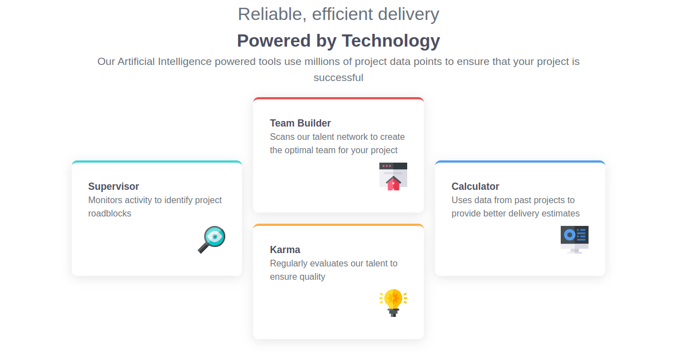

# Four Card Feature Section Solution

This is my solution to the [Four card feature section challenge on Frontend Mentor](https://www.frontendmentor.io/challenges/four-card-feature-section-weK1eFYK). The goal of this challenge was to build a responsive layout that looks clean, elegant, and works across different screen sizes using modern CSS techniques.

---

## 📋 Table of contents

- [Overview](#overview)
  - [The challenge](#the-challenge)
  - [Screenshot](#screenshot)
  - [Links](#links)
- [My process](#my-process)
  - [Built with](#built-with)
  - [What I learned](#what-i-learned)
  - [Continued development](#continued-development)
  - [Useful resources](#useful-resources)
- [Author](#author)

---

## 🔍 Overview

### 💡 The challenge

Users should be able to:

- View the layout in a mobile-first format
- See the layout adapt perfectly across devices
- Experience a "+"-shaped responsive card layout on desktop

---

### 🖼️ Screenshot



---

### 🔗 Links

- 🛠️ [Solution on Frontend Mentor](https://www.frontendmentor.io/solutions/responsive-four-card-feature-grid-using-css-grid-and-media-queries-XXXXX)
- 🌐 [Live Site URL](https://yourusername.github.io/four-card-feature-section/)

---

## 💻 My Process

### 🧱 Built With

- Semantic HTML5
- Custom CSS variables
- **CSS Grid** – for the desktop “plus shape” layout
- Flexbox – for mobile responsiveness
- Mobile-first design philosophy

---

### ✨ What I Learned

- How to use `grid-template-areas` to structure a responsive, complex layout without relying on `position: absolute`.
- How to design for mobile first and progressively enhance for larger viewports.
- How to structure HTML to make styling easier and avoid layout frustration.

```css
.card-one{
        grid-column: 1 / 2;
        grid-row: 2 / 4;
    }

    .card-two{
        grid-column: 2 / 3;
        grid-row: 2 / 3;
    }

    .card-three{
        grid-column: 2 / 3;
        grid-row: 3 / 4;
    }

    .card-four{
        grid-column: 3 / 4;
        grid-row: 2 / 4;
    }
```
## 🚧 Continued Development

In the future, I’d like to:

- Convert the project to **SCSS** for better scalability and maintainability  
- Add entrance animations to the cards using `@keyframes`
- Explore using utility-first CSS frameworks like **Tailwind CSS** to simplify styles

---

## 📚 Useful Resources

- [CSS Grid Guide by MDN](https://developer.mozilla.org/en-US/docs/Web/CSS/CSS_Grid_Layout) – Solid foundation on grid properties  
- [CSS Tricks Complete Guide to Grid](https://css-tricks.com/snippets/css/complete-guide-grid/) – Great visual reference  
- [Frontend Mentor Discord Community](https://discord.gg/frontendmentor) – Helpful for peer support and feedback

---

## 👨‍💻 Author

- Github – [Michael-Okorie](https://github.com/Michael-Okorie)  
- Frontend Mentor – [@Michael Okorie](https://www.frontendmentor.io/profile/Michael-Okorie)  
- Twitter – [@Dev_Michael_](https://x.com/Dev_Michael_)

---

## 🙌 Acknowledgments

Shoutout to the **Frontend Mentor** community for providing high-quality design challenges that push us to improve!  
And special thanks to [@KevinPowell](https://www.youtube.com/kepowob) for his amazing CSS tutorials.

